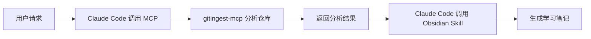

# gitingest-mcp

> [!tip]
> **MCP HTTP 服务器**，封装 [gitingest](https://github.com/coderamp-labs/gitingest)，让 Claude Code 能够分析 GitHub 仓库并生成 Obsidian 中文学习笔记。

## ✨ 功能特性

- **GitHub 仓库分析** - 通过 MCP 协议获取仓库结构、统计和完整内容
- **智能文件过滤** - 默认分析文档文件（md, json, toml, yaml 等）
- **256k Token 自动降级** - 超过限制时自动切换到 README-only 模式
- **私有仓库支持** - 通过 GitHub token 访问私有仓库
- **子目录分析** - 支持分析仓库的特定子目录
- **Obsidian 集成** - 自动调用 Obsidian 相关 skill 生成结构化学习笔记

## 📦 快速开始

### 1. 部署服务器

#### Docker Compose 部署（推荐）

```bash
# 克隆项目
git clone https://github.com/tunanet/gitingest-mcp.git
cd gitingest-mcp

# 启动服务
docker-compose up -d

# 查看日志
docker-compose logs -f
```

#### Docker 部署

```bash
# 构建镜像
docker build -t gitingest-mcp .

# 运行容器
docker run -d \
  --name gitingest-mcp \
  -p 8000:8000 \
  -e GITHUB_TOKEN=your_token_if_needed \
  --restart unless-stopped \
  gitingest-mcp
```

#### 其他部署方式

<details>
<summary>Systemd 守护进程</summary>

```bash
# 安装依赖
pip install -e .

# 创建 systemd 服务
sudo nano /etc/systemd/system/gitingest-mcp.service
```

添加内容：
```ini
[Unit]
Description=Gitingest MCP Server
After=network.target

[Service]
Type=simple
User=your_user
WorkingDirectory=/path/to/gitingest-mcp
Environment="PORT=8000"
ExecStart=/usr/bin/python -m server.main
Restart=always

[Install]
WantedBy=multi-user.target
```

启动服务：
```bash
sudo systemctl daemon-reload
sudo systemctl enable gitingest-mcp
sudo systemctl start gitingest-mcp
```
</details>

<details>
<summary>PaaS 平台部署</summary>

**Railway:**
```bash
npm install -g railway
railway login
railway up
```

**Render:**
1. 在 Render Dashboard 创建新的 Web Service
2. 连接 GitHub 仓库 `tunanet/gitingest-mcp`
3. 设置构建命令: `pip install -e . && uvicorn server.main:app --host 0.0.0.0 --port $PORT`
</details>

### 2. 在 Claude Code 中注册 MCP 服务器

```bash
# 替换为你的部署 URL
claude mcp add --transport http gitingest https://your-app.example.com/mcp
```

### 3. 验证安装

```bash
# 检查 MCP 服务器状态
curl https://your-app.example.com/health
```

## 🚀 在 Claude Code 中使用

### 基本用法

部署完成后，在 Claude Code 中直接与 AI 对话即可：

```
你: 帮我分析 https://github.com/coderamp-labs/gitingest 这个项目，生成 obsidian 中文学习笔记

Claude Code 会：
1. 自动调用 analyze_repo 工具获取仓库分析
2. 理解项目结构和功能
3. 自动调用 Obsidian 相关 skill
4. 生成结构化的 Obsidian 学习笔记
```

### 高级用法

#### 指定子目录

```
分析 https://github.com/owner/repo 的 docs 目录
```

#### 使用全文件模式

```
帮我分析 https://github.com/owner/repo，分析所有源代码文件
```

#### 强制只分析 README

```
分析 https://github.com/owner/repo，只看 README 即可
```

### 工作流程



## ⚙️ 配置

### 环境变量

| 变量 | 说明 | 默认值 |
|:-----|:-----|:-------|
| `PORT` | 服务器端口 | `8000` |
| `GITHUB_TOKEN` | GitHub token（私有仓库需要） | - |

### GitHub Token 获取

1. 访问 [GitHub Settings > Personal Access Tokens](https://github.com/settings/tokens)
2. 生成新 token（需要 `repo` 权限）
3. 设置环境变量或启动时传入

## 🛠️ MCP 工具参数

`analyze_repo` 工具支持以下参数：

| 参数 | 类型 | 必填 | 说明 |
|:-----|:-----|:----:|:-----|
| `url` | string | ✅ | GitHub 仓库 URL |
| `subdirectory` | string | ❌ | 只分析指定子目录 |
| `github_token` | string | ❌ | 用于私有仓库的 GitHub token |
| `default_branch` | string | ❌ | 默认分支名（默认为 `main`）|
| `include_patterns` | string | ❌ | 文件包含模式（默认使用文档模式）|
| `fallback_to_readme` | boolean | ❌ | 强制只分析 README |

### include_patterns 选项

| 值 | 说明 |
|:---|:-----|
| 默认（不指定）| 分析文档文件（md, json, toml, yaml, txt, cfg, ini, conf）|
| `"all"` | 分析所有文件（包括源代码）|
| `"*.py,*.js"` | 自定义文件模式 |

## 📝 返回结果格式

```json
{
  "summary": {
    "repo_name": "owner/repo",
    "description": "仓库描述...",
    "total_files": 42,
    "estimated_tokens": 15000
  },
  "tree": "目录结构树...",
  "content": "文件内容...",
  "metadata": {
    "source_url": "https://github.com/owner/repo",
    "include_patterns": "*.md,*.json,...",
    "was_fallback": false,
    "fallback_reason": null
  }
}
```

## 🔒 反向代理配置（生产环境推荐）

服务默认绑定 `127.0.0.1:8000`，建议通过 Nginx 反向代理暴露公网。

### HTTP 配置

```nginx
server {
    listen 80;
    server_name your-domain.com;

    location / {
        proxy_pass http://127.0.0.1:8000;
        proxy_set_header Host $host;
        proxy_set_header X-Real-IP $remote_addr;
        proxy_set_header X-Forwarded-For $proxy_add_x_forwarded_for;
        proxy_set_header X-Forwarded-Proto $scheme;
    }
}
```

### HTTPS 配置（使用 Let's Encrypt）

```nginx
server {
    listen 80;
    server_name your-domain.com;
    return 301 https://$server_name$request_uri;
}

server {
    listen 443 ssl;
    server_name your-domain.com;

    ssl_certificate /etc/letsencrypt/live/your-domain.com/fullchain.pem;
    ssl_certificate_key /etc/letsencrypt/live/your-domain.com/privkey.pem;

    location / {
        proxy_pass http://127.0.0.1:8000;
        proxy_set_header Host $host;
        proxy_set_header X-Real-IP $remote_addr;
        proxy_set_header X-Forwarded-For $proxy_add_x_forwarded_for;
        proxy_set_header X-Forwarded-Proto $scheme;
    }
}
```

## 🧪 本地开发

```bash
# 安装依赖
pip install -e .

# 启动服务器
python -m server.main

# 运行测试
pytest
```

## 📚 使用示例

### 示例 1：分析开源项目

```
你: 帮我分析 https://github.com/tiangolo/fastapi 这个项目，生成 obsidian 中文学习笔记
```

### 示例 2：分析特定子目录

```
你: 分析 https://github.com/owner/repo 的 src/core 目录，生成学习笔记
```

### 示例 3：私有仓库分析

```
你: 分析我公司的私有仓库 https://github.com/mycompany/private-repo
（需提前配置 GITHUB_TOKEN 环境变量）
```

### 示例 4：快速了解项目

```
你: 快速帮我了解 https://github.com/vitejs/vite 这个项目是做什么的
```

## 🐛 故障排除

### MCP 服务器无法连接

1. 检查服务器状态：`curl https://your-app.example.com/health`
2. 检查防火墙设置
3. 确认反向代理配置正确

### 分析超时

- 大型仓库可能需要较长时间
- 默认超时时间为 120 秒
- 可以通过指定 `subdirectory` 减少分析范围

### Token 限制

- 默认使用文档模式以减少 token 使用
- 超过 256k token 会自动降级到 README-only 模式
- 可通过 `fallback_to_readme=true` 强制使用 README 模式

## 📄 License

MIT

## 🙏 致谢

- [gitingest](https://github.com/coderamp-labs/gitingest) - 核心仓库分析库
- [Claude](https://claude.ai) - Anthropic 出品的 AI 助手
